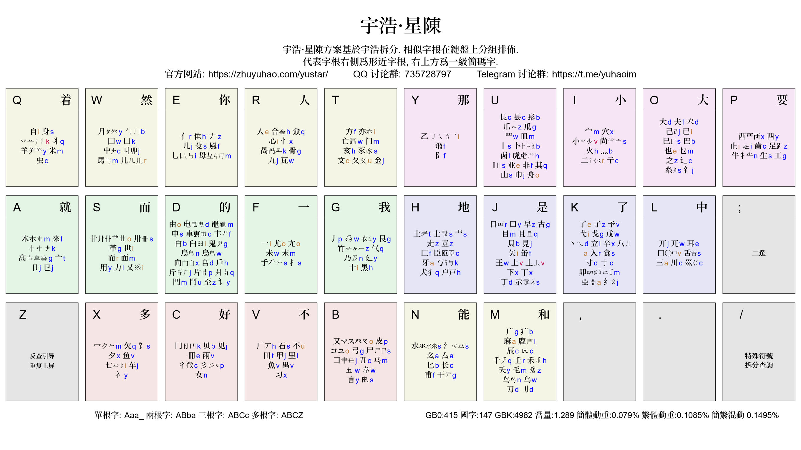

<!-- omit in toc -->
# 宇浩·星陳
{: .no_toc }

  

    目录
  

  {: .text-delta }
1. TOC
{:toc}

{: .highlight }
>官方 QQ 群: [735728797](https://jq.qq.com/?_wv=1027&k=2OYDP4Tk) · 
>官方 TG 群: [yuhaoim](https://t.me/yustarim)  
>[最新测试版本下载](https://github.com/forFudan/yustar/releases/) · 
<!-- >[备用下载地址](https://gitee.com/forFudan/yustar/releases/)   -->
>[拆分查询(支持台湾字形)](./star/chaifen/)  

## 简介

**宇浩·星陈**是[**宇浩输入法**](http://zhuyuhao.com/yuhao/)的次世代方案，具有强聚类、强音托、弱分区的特点。

它继承了宇浩输入法的如下属性：

- 单字拆分和字根设置。
- 繁簡通打，混合文本低重码。
- 兼容大陆通规、大陆古籍、台湾规范三套字形。
- 面向大字集，全面覆盖 CJK 全字集 99000 多个漢字和部首。
- 双编码，不分主副根，没有结构码。
- 单字编码规则和词语编码规则，取一、二、三、末字根。全简一致。

它和宇浩输入法有以下不同：

- 字根大码：不再根据首笔笔画在键盘上分区排布，而是根据字根的相似程度进行分组后，在25键上不分区排布。比如「白臼向𠂤戶」此类都有一撇一框的字根都安排在了 `D` 键上。
- 字根小码：强音托，80% 情况下都是声母。
- 使用`Z`键：这样能保证小码能取到声母。但`Z`键上不设置字根，故而`Z`键依旧可以作为反查引导符使用。
- 优化键均当量和双手互击率，键均当量为 1.30，双手互击率大于 60%。
- 按键频率遵循「中指最高，两侧递减」的原则，左右手按键频率比为 55 : 45。

| 特点                       | 宇浩·卿雲 | 宇浩·光華 | 宇浩·星陈 |
| :------------------------- | :-------- | :-------- | :-------- |
| 更新维护中                 | ❌         | ✅         | ✅         |
| 使用宇浩拆分               | ✅         | ✅         | ✅         |
| CJK ext-I 支持             | ❌         | ✅         | ✅         |
| 兼容台湾字形拆分           | ❌         | ✅         | ✅         |
| 繁简通打时低动态选重率     | ✅         | ✅         | ✅         |
| 字根双编码                 | ✅         | ✅         | ✅         |
| 字根字全码重复小码而非加 f | ❌         | ✅         | ✅         |
| 附属根比代表根多补一码     | ✅         | ✅         | ❌         |
| 大码使用 Z 键              | ❌         | ❌         | ❌         |
| 小码使用 Z 键              | ❌         | ❌         | ✅         |
| 字根首笔画分区             | ✅         | ✅         | ❌         |
| 相似字形字根同分区聚类     | ✅         | ✅         | ❌         |
| 相似字形字根同大码聚类     | ❌         | ❌         | ✅         |
| 小码使用拼音中的字母       | ✅         | ✅         | ✅         |
| 小码 85% 使用拼音首字母    | ❌         | ❌         | ✅         |
| 双手互击率大于 60%         | ❌         | ❌         | ✅         |
| 严格优化键位分布           | ❌         | ❌         | ✅         |
| Z 键反查                   | ✅         | ✅         | ✅         |

## 入门指南

由于宇星方案同[宇浩输入法](https://zhuyuhao.com/yuhao/)的字根设置和单字拆分完全一致，只有字根的大小码设置不同，故而可直接使用[宇浩输入法快速入门](https://zhuyuhao.com/yuhao/docs/cookbook.html)和[宇浩输入法详细教程](https://zhuyuhao.com/yuhao/docs/learn.html)学习基本规则。

### 大码记忆

宇星方案不再对字根进行首笔分区，而是使用了强聚类，使拥有相似字形的字根抱团出现（可参见字根图）。因此，在记忆字根的时候，只需要记忆一个代表的字根，就可以联想类推出其他字根。最后，只要特别记忆一些零散字根的位置就好。

以下表格中，更加直观展示了每个按键上字根的聚类：

| 大码 | 字根                                            |
| :--- | :---------------------------------------------- |
| A    | 木來　㔾卩　亠高　キ丁                          |
| B    | 皮又马彐尸弓丑韋(横折)　言入                    |
| C    | 冂贝见冊雨(下框)　女　彳彡(几撇)                  |
| D    | 由电申車丰　白𠂤臼戶鬼向烏鳥斤爿片　鬥門　至　讠 |
| E    | 亻𠂇隹　几殳風　母乚                         |
| F    | 未末　一　手　尤                                |
| G    | 丿竹气𧘇不　乃廴　黽十黑艮                       |
| H    | 土士壴走　匚臣牙　寸𬺰　犬丂户                   |
| I    | 宀穴　小尚　二亍　火灬业                        |
| J    | 日曰　早古　上下　目且見貝　缶矢　王示          |
| K    | 了子予　立辛　弋戈戊　　八食　卯纟丶            |
| L    | 兀丌耳　口舌　巛川三                            |
| M    | 广疒麻鹿　夭壬千毛禾　乌鸟　刀刂　辰            |
| N    | 水氵　厶幺　长匕　干甫                          |
| O    | 己已巳巴　大夫𡗗龶　也乜　辶之　糸钅             |
| P    | 止龰足齒　酉西　生牛工　阝                      |
| Q    | 丷丬羊米　自身　九虫                            |
| R    | 心忄　人合僉　咼骨　瓦                          |
| S    | 艹卅世革　而面　用力乂                          |
| T    | 方文夂亦亡亥豕　金门                            |
| U    | 爪瓜　罒皿　長镸髟　丨非卜虎鹵　山巾　其舟      |
| V    | 田甲里禺魚(田下出头)　石厂　豸习                |
| W    | 月勹　凵丩屮　儿囗馬                            |
| X    | 冖夕饣欠鱼　车七　衤                            |
| Y    | 乙飛                                            |

### 小码记忆

星陈方案使用强音托，字根小码 80% 以上情况下都是汉语拼音的第一个字母。故而大部分的字根小码不用特别记忆，可以猜出来。

由于很多字根拼音只有两个字母，首字母容易被占用，故而 80% 情况下会选取其后续字母作为音托。只要特别记住以下字根即可：

| 小码  | 字根                                 |
| :---- | :----------------------------------- |
| a     | 三八                                 |
| o     | 又尤由舟鬥(韵母是ou)　艹             |
| e     | 人臣文了业                           |
| i　ㄧ | 一乂弋己七(拼音都是两个字母)　心　臼 |
| i     | 矢世十(shi)　止自                    |
| u     | 木不入                               |
| v　ㄣ | 鱼魚                                 |
| r　ㄦ | 二儿耳(拼音是er的都取r)              |

以下字根虽然没有使用声母音托，但大小码刚好等于其拼音：

乙麻卅冊

最后，以下字根的声母让给了使用频率较低的字根，所以它们的小码是 v：

上小已口

## 測評數據

### 虎碼測評網

使用[虎碼測評網](https://tiger-code.com/assess.html)的測評結果如下。

### 單字全碼

| 形码方案   | 简体选重率 | 繁体选重率 | 繁简混合文本选重率 | GB2312 | 国字常用 |   GBK | CJK-B | CJK-D | CJK-F | CJK-H |
| :--------- | :--------- | :--------- | :----------------- | -----: | -------: | ----: | :---- | :---- | :---- | :---- |
| 五笔86     | 34.2‱      | 77.7‱      | 238.3‱             |    521 |      333 |  6453 | 36494 | 36494 | NA    | NA    |
| 五笔98     | 31.8‱      | 79.5‱      | 240.0‱             |    515 |      330 |  6378 | NA    | NA    | NA    | NA    |
| 五笔06     | 31.8‱      | 83.8‱      | 236.3‱             |    532 |      387 |  6610 | NA    | NA    | NA    | NA    |
| 蓝宝石     | 21.6‱      | 57.3‱      | 58.4‱              |    388 |      284 |  5082 | NA    | NA    | NA    | NA    |
| 郑码       | 59.0‱      | 83.6‱      | 262.8‱             |    559 |      316 |  6631 | 36159 | 39353 | 43715 | NA    |
| 真码       | 7.0‱       | 60.1‱      | 273.7‱             |    422 |      238 |  6668 | NA    | NA    | NA    | NA    |
| 徐码13     | 10.4‱      | 23.5‱      | 24.9‱              |    324 |      125 |  2872 | 25507 | 27889 | 35707 | 38994 |
| 徐码23     | 10.7‱      | 22.8‱      | 24.9‱              |    318 |      127 |  2902 | 25605 | 27956 | 35746 | 39021 |
| 宇浩       | 4.3‱       | 15.1‱      | 15.7‱              |    320 |      198 |  5162 | 33239 | 35898 | 44526 | 50696 |
| 宇浩星陳   | 7.9‱       | 11.1‱      | 15.1‱              |    410 |      158 |  4971 | 33286 | 36070 | 45046 | 51803 |
| 仓颉五代   | 25.9‱      | 57.0‱      | 51.0‱              |    422 |      164 |  2893 | 21008 | 22901 | NA    | NA    |
| 蒼颉六代   | 25.3‱      | 39.6‱      | 40.0‱              |    384 |      113 |  2378 | 17949 | 19590 | 25415 | 29603 |
| 三码郑码   | 51.4‱      | 281.1‱     | 379.4‱             |   2700 |     1578 | 16490 | NA    | NA    | NA    | NA    |
| 三码吉旦饼 | 45.1‱      | 69.9‱      | 95.9‱              |   2005 |      897 | 15262 | NA    | NA    | NA    | NA    |
| 山人全息   | 6.4‱       | 39.0‱      | 246.1‱             |    192 |       84 |  3948 | 15611 | 17421 | 19866 | 22484 |

### 單字二簡

| 形码方案 | 简体选重率 | 繁体选重率 | 繁简混合文本选重率 | GB2312 | 国字常用 |   GBK | CJK-B | CJK-D | CJK-F | CJK-H |
| :------- | :--------- | :--------- | :----------------- | -----: | -------: | ----: | :---- | :---- | :---- | :---- |
| 五笔86   | 21.8‱      | 69.0‱      | 168.5‱             |    451 |      293 |  6111 | 35953 | 35953 | NA    | NA    |
| 蓝宝石   | 5.2‱       | 36.9‱      | 30.7‱              |    301 |      245 |  4815 | NA    | NA    | NA    | NA    |
| 郑码     | 24.5‱      | 47.7‱      | 152.2‱             |    460 |      283 |  6405 | 35853 | 39035 | 43392 | NA    |
| 真码     | 6.1‱       | 59.6‱      | 262.0‱             |    412 |      234 |  6655 | NA    | NA    | NA    | NA    |
| 徐码23   | 9.1‱       | 19.0‱      | 19.1‱              |    353 |      119 |  2871 | 25378 | 27721 | 35456 | 38724 |
| 宇浩     | 3.4‱       | 14.0‱      | 13.9‱              |    297 |      174 |  5020 | 32921 | 35572 | 44167 | 50320 |
| 宇浩星陳 | 5.5‱       | 9.8‱       | 12.5‱              |    356 |      140 |  4791 | 32901 | 35673 | 44598 | 51335 |
| 三码郑码 | 51.4‱      | 281.1‱     | 379.4‱             |   2700 |     1578 | 16490 | NA    | NA    | NA    | NA    |
| 山人全息 | 5.0‱       | 38.1‱      | 141.1‱             |    499 |      266 |  4430 | 15894 | 17707 | 20147 | 22757 |

### 連續文本互擊率

| 方案            | 均值   | 毛泽东选集(简) | 天龙八部(简) | 三体三部曲(简) | 战争与和平(简) | 史記(繁) | 紅樓夢(繁) | 笑傲江湖(繁) | 論語集解(繁簡) | 三國演義(繁簡) | 海上花列傳(繁簡) |
| :-------------- | :----- | :------------- | :----------- | :------------- | :------------- | :------- | :--------- | :----------- | :------------- | :------------- | :--------------- |
| 三码吉旦餅·26键 | 46.50% | 48.89%         | 48.76%       | 48.52%         | 46.67%         | 43.79%   | 45.26%     | 45.10%       | 48.19%         | 43.81%         | 46.05%           |
| 蓝宝石·25键     | 39.85% | 41.44%         | 41.33%       | 41.05%         | 40.83%         | 37.91%   | 38.81%     | 40.26%       | 43.01%         | 37.30%         | 36.62%           |
| 宇浩星陳·26键   | 39.22% | 39.71%         | 39.80%       | 40.25%         | 41.05%         | 36.11%   | 39.18%     | 39.47%       | 38.33%         | 37.89%         | 40.42%           |
| 宇浩·25键       | 36.67% | 38.42%         | 37.02%       | 37.82%         | 36.62%         | 34.72%   | 37.06%     | 36.06%       | 37.02%         | 36.34%         | 35.63%           |
| 郑码·26键       | 34.40% | 32.14%         | 34.58%       | 34.35%         | 35.52%         | 34.97%   | 33.72%     | 33.77%       | 34.03%         | 34.84%         | 36.08%           |
| 山人全息·26键   | 34.11% | 34.60%         | 34.22%       | 34.65%         | 35.02%         | 33.56%   | 33.35%     | 33.76%       | 34.16%         | 33.57%         | 34.19%           |
| 徐码23          | 33.98% | 33.71%         | 33.40%       | 33.29%         | 33.14%         | 34.46%   | 33.91%     | 32.63%       | 34.87%         | 34.94%         | 35.50%           |
| 真码·25键       | 33.51% | 35.21%         | 34.31%       | 35.46%         | 34.33%         | 32.57%   | 33.75%     | 33.18%       | 29.86%         | 33.24%         | 33.20%           |
| 五筆06·25键     | 32.21% | 33.25%         | 31.99%       | 33.90%         | 33.83%         | 31.55%   | 32.03%     | 31.22%       | 30.45%         | 32.33%         | 31.52%           |
| 五筆98·25键     | 32.20% | 33.07%         | 32.48%       | 34.18%         | 33.82%         | 31.30%   | 31.85%     | 31.31%       | 30.12%         | 32.45%         | 31.44%           |
| 三码郑码·26键   | 31.19% | 29.80%         | 29.30%       | 30.46%         | 32.98%         | 31.26%   | 31.85%     | 30.89%       | 30.97%         | 31.91%         | 32.47%           |
| 五筆86·25键     | 31.12% | 32.64%         | 31.48%       | 33.20%         | 32.49%         | 30.53%   | 31.55%     | 30.39%       | 27.53%         | 30.79%         | 30.64%           |
| 倉頡五代·25键   | 30.60% | 29.44%         | 30.02%       | 28.88%         | 31.70%         | 29.86%   | 31.13%     | 32.48%       | 28.70%         | 31.01%         | 32.75%           |

### 世界名著單字二簡選重

| 方案       | 毛泽东选集(简) | 天龙八部(简) | 三体三部曲(简) | 战争与和平(简) |
| :--------- | :------------- | :----------- | :------------- | :------------- |
| 五笔86     | 5.7‱           | 15.6‱        | 12.1‱          | 9.0‱           |
| 蓝宝石     | 3.8‱           | 5.6‱         | 1.7‱           | 2.2‱           |
| 真码       | 1.1‱           | 3.0‱         | 2.1‱           | 2.1‱           |
| 徐码23     | 3.2‱           | 7.9‱         | 5.8‱           | 7.3‱           |
| 宇浩       | 1.0‱           | 2.3‱         | 2.3‱           | 1.9‱           |
| 宇浩星陳   | 3.2‱           | 5.4‱         | 1.4‱           | 4.2‱           |
| 三码郑码   | 9.5‱           | 46.8‱        | 26.2‱          | 29.4‱          |
| 三码吉旦饼 | 22.7‱          | 43.5‱        | 29.2‱          | 35.1‱          |
| 山人全息   | 129.9‱         | 173.6‱       | 152.3‱         | 152.5‱         |

| 方案       | 史記(繁) | 紅樓夢(繁) | 笑傲江湖(繁) |
| :--------- | :------- | :--------- | :----------- |
| 五笔86     | 75.0‱    | 24.1‱      | 35.0‱        |
| 蓝宝石     | 35.3‱    | 20.4‱      | 19.5‱        |
| 真码       | 44.9‱    | 14.2‱      | 14.6‱        |
| 徐码23     | 23.6‱    | 10.2‱      | 8.0‱         |
| 宇浩       | 22.9‱    | 8.3‱       | 5.6‱         |
| 宇浩星陳   | 30.0‱    | 8.4‱       | 7.0‱         |
| 三码郑码   | 294.8‱   | 142.6‱     | 131.0‱       |
| 三码吉旦饼 | 103.1‱   | 62.1‱      | 37.7‱        |
| 山人全息   | 117.7‱   | 99.9‱      | 109.6‱       |

| 方案       | 論語集解(繁簡混) | 三國演義(繁簡混) | 海上花列傳(繁簡混) |
| :--------- | :--------------- | :--------------- | :----------------- |
| 五笔86     | 192.0‱           | 242.8‱           | 187.5‱             |
| 蓝宝石     | 9.8‱             | 43.9‱            | 17.0‱              |
| 真码       | 290.1‱           | 405.0‱           | 331.9‱             |
| 徐码23     | 12.7‱            | 35.5‱            | 27.7‱              |
| 宇浩       | 3.9‱             | 21.5‱            | 8.4‱               |
| 宇浩星陳   | 2.9‱             | 27.7‱            | 16.1‱              |
| 三码郑码   | 337.5‱           | 555.2‱           | 398.3‱             |
| 三码吉旦饼 | 35.2‱            | 123.6‱           | 85.4‱              |
| 山人全息   | 415.6‱           | 686.1‱           | 597.8‱             |

### 世界名著單字二簡碼長

| 方案     | 简体均值 | 毛泽东选集(简) | 天龙八部(简) | 三体(简) | 战争与和平(简) | 史記(繁) | 紅樓夢(繁) | 笑傲江湖(繁) | 論語集解(繁簡混) |
| :------- | -------: | -------------: | -----------: | -------: | -------------: | -------: | ---------: | -----------: | ---------------: |
| 蓝宝石   |     3.05 |           3.04 |          3.1 |     3.03 |           3.05 |     3.48 |       3.29 |         3.29 |             3.36 |
| 宇浩     |      3.1 |           3.13 |         3.13 |     3.07 |           3.09 |     3.52 |       3.29 |          3.3 |              3.4 |
| 宇浩星陳 |     3.14 |           3.15 |         3.18 |     3.11 |           3.13 |     3.54 |       3.32 |         3.34 |             3.43 |
| 五笔06   |     3.17 |           3.09 |         3.23 |     3.16 |            3.2 |     3.49 |       3.36 |         3.36 |             3.38 |
| 徐码23   |     3.18 |           3.15 |         3.21 |     3.18 |           3.17 |     3.49 |       3.32 |         3.33 |             3.33 |
| 五笔98   |     3.19 |           3.09 |         3.26 |     3.19 |           3.22 |     3.48 |       3.38 |         3.39 |             3.35 |
| 五笔86   |     3.22 |           3.12 |         3.31 |     3.21 |           3.24 |     3.59 |       3.44 |         3.45 |             3.49 |
| 郑码     |     3.23 |           3.18 |         3.31 |     3.19 |           3.23 |     3.54 |        3.4 |         3.41 |             3.49 |
| 真码     |      3.5 |           3.47 |         3.54 |     3.47 |           3.53 |     3.67 |       3.57 |         3.56 |             3.63 |
